# 🧠 ZİHİN AVCISI

Modern, oyunlaştırılmış bilgi yarışması uygulaması.

---

# 📌 Proje Hakkında

Zihin Avcısı; oyuncuların seviyeleri geçerek ilerlediği, süreye karşı yarıştığı, can sistemi ve joker mekanikleri içeren gelişmiş bir quiz oyunudur.

Oyuncu:

* Bölümleri tamamlar
* Altın kazanır
* Yeni bölümlerin kilidini açar
* Joker kullanır
* Liderlik tablosunda yükselir
* Süreye karşı yarışır

Oyun tamamen modern mobil oyun mantığında geliştirilmiştir.

---
# # # EKRAN GÖRÜNTÜLERİ # # # 
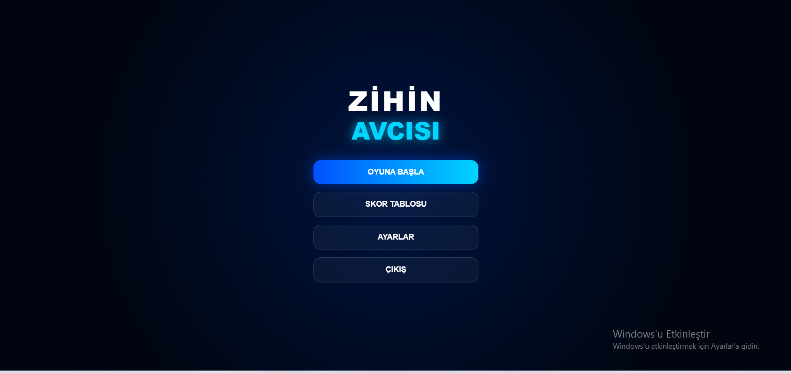

--Oyuncunun oyuna giriş yaptığı, skor tablosuna ve ayarlara erişebildiği modern ana ekran tasarlanmıştır.


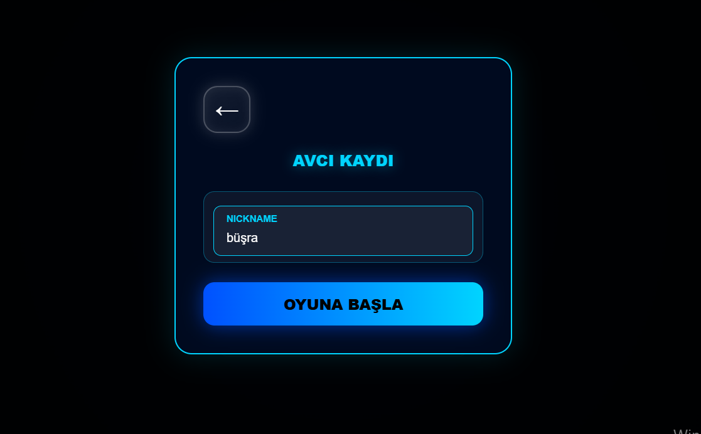


--Oyuncular nickname oluşturarak ilerlemelerini kayıtlı şekilde sürdürebilmektedir.

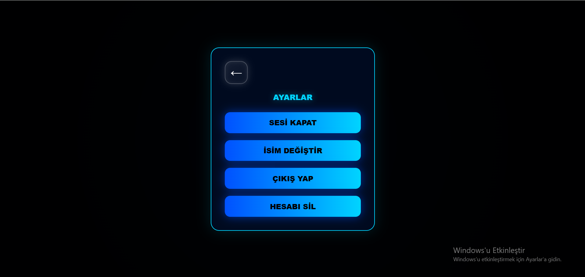


--Oyuncular ses kontrolü, isim değiştirme, çıkış yapma ve hesap silme işlemlerini gerçekleştirebilmektedir.

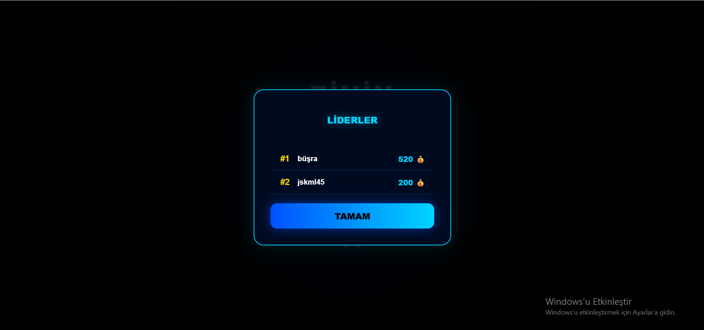

--Oyuncuların kazandığı altınlar liderlik tablosunda sıralanarak rekabet ortamı oluşturulmuştur.


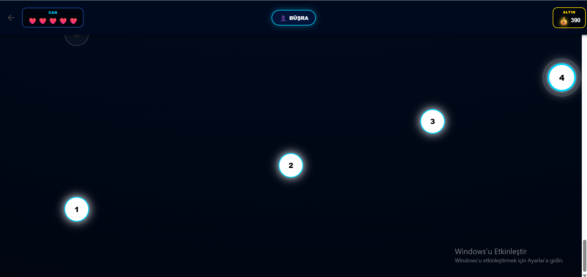

--Oyunda ilerledikçe yeni bölümlerin açıldığı harita tabanlı bir seviye sistemi geliştirilmiştir.


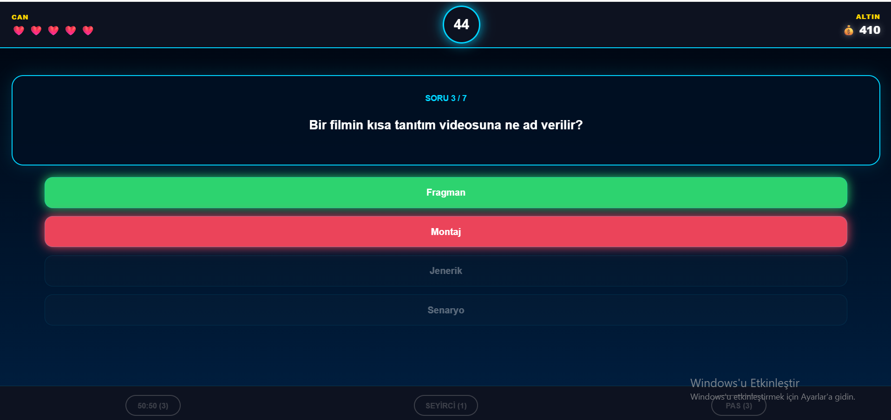


--Her bölümde rastgele sorular getirilerek oyuncuya dinamik bir quiz deneyimi sunulmuştur.


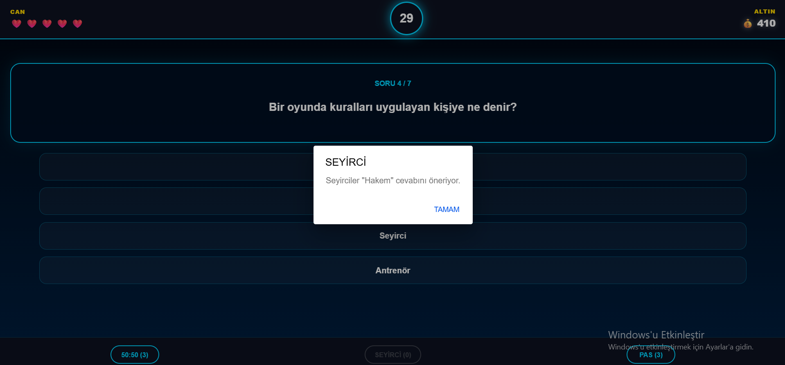


--Seyirci jokeri oyuncuya öneri cevabı sunarak zor sorularda yardımcı olmaktadır.


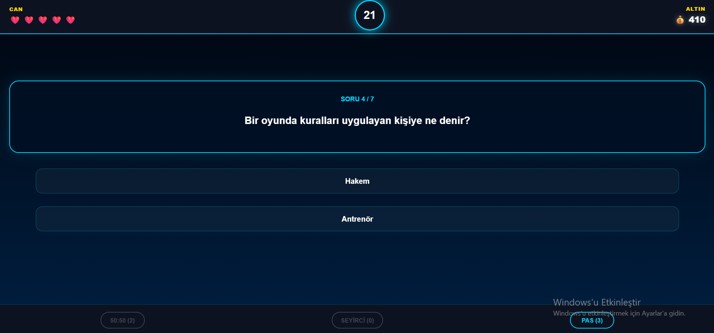


--%50 jokeri iki yanlış şıkkı kaldırarak oyuncunun doğru cevabı bulmasını kolaylaştırmaktadır.

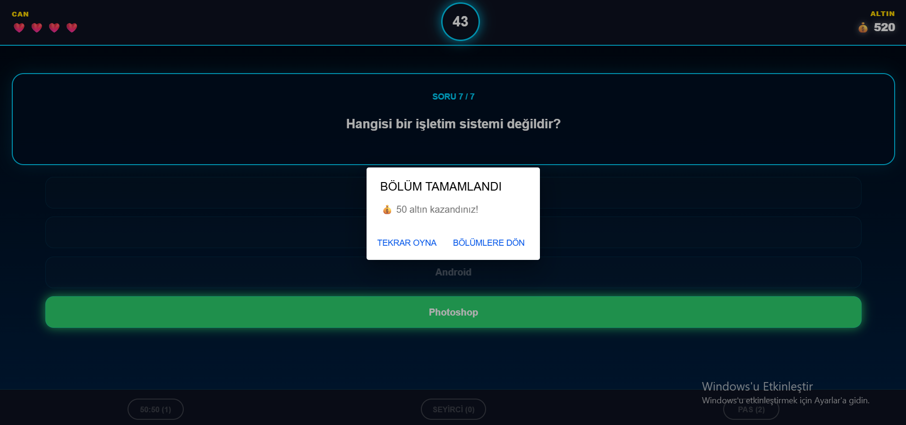


--Bölüm başarıyla tamamlandığında oyuncuya altın ödülü verilmekte ve yeni bölümlerin kilidi açılmaktadır.

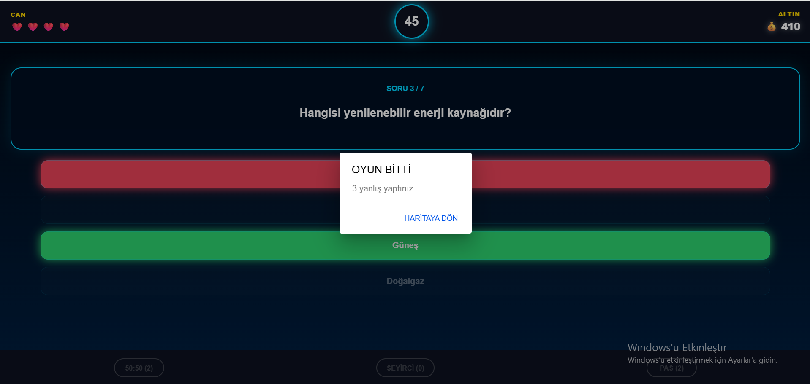


--Oyuncu 3 yanlış cevap verdiğinde bölüm başarısız sayılır ve oyun sonlandırılır.


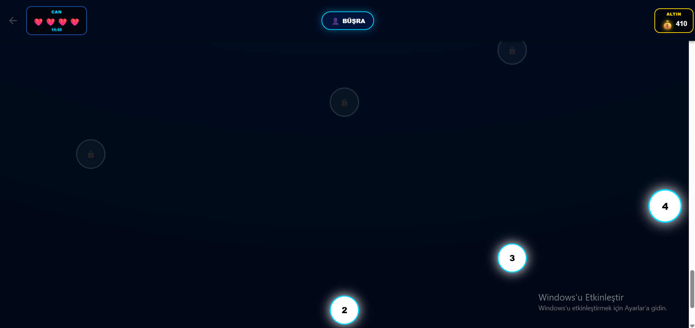

--Oyuncular belirli sayıda can hakkına sahiptir ve canlar süreye bağlı olarak otomatik yenilenmektedir.


# 🎮 Oyun Mekanikleri

## 🔓 Bölüm Sistemi

* Toplam 50 bölüm bulunur.
* Bölümler sırayla açılır.
* Bir bölüm tamamlanmadan sonraki bölüm açılamaz.
* Aktif bölüm neon efektlerle gösterilir.

---

## ❤️ Can Sistemi

Oyuncu başlangıçta:

* 5 can ile başlar.

Her başarısız oyunda:

* 1 can eksilir.

Canlar:

* Her 15 dakikada otomatik yenilenir.
* Oyun kapalıyken bile süre işlemeye devam eder.
* Oyuncu geri geldiğinde eksik canlar otomatik hesaplanır.

---

## 💰 Altın Sistemi

Oyuncular:

* Doğru cevaplardan
* Bölüm tamamlamaktan
* Hatasız oyunlardan

altın kazanır.

### Ödüller

| Durum                       | Ödül      |
| --------------------------- | --------- |
| Normal bölüm bitirme        | 50 altın  |
| Hatasız ve jokersiz bitirme | 100 altın |
| Doğru cevap                 | 10 altın  |

---

# 🃏 Joker Sistemi

Oyunda 3 farklı joker vardır.

## 1️⃣ %50 Jokeri

* Yanlış şıklardan 2 tanesini kaldırır.

---

## 2️⃣ Seyirci Jokeri

* Seyircilerin önerdiği cevabı gösterir.

---

## 3️⃣ Pas Jokeri

* Soruyu direkt geçer.

---

## 🎁 Joker Kazanma

Her 3 bölümde bir:

* +1 %50
* +1 Seyirci
* +1 Pas

jokeri otomatik verilir.

---

# ⏱️ Süre Sistemi

Bölüm zorluğuna göre süre değişir.

| Bölüm   | Süre      |
| ------- | --------- |
| 1 - 20  | 45 saniye |
| 21 - 40 | 30 saniye |
| 41 - 50 | 20 saniye |

Son 10 saniyede:

* Gerilim sesi başlar.

---

# 🧩 Zorluk Sistemi

Sorular 3 kategoriye ayrılmıştır.

## 🟢 Easy

* Bölüm 1 - 20

## 🟠 Medium

* Bölüm 21 - 40

## 🔴 Hard

* Bölüm 41 - 50

---

# ❓ Soru Sistemi

* Sorular JSON üzerinden yüklenir.
* Sorular random gelir.
* Aynı sorular tekrar çıkmaz.
* Kullanılan sorular LocalStorage içinde tutulur.
* Sorular bitince sistem otomatik sıfırlanır.

---

# 🏆 Liderlik Sistemi

Oyuncuların:

* Toplam altınları
* En yüksek skorları

kaydedilir.

Sistem:

* Top 10 oyuncuyu saklar.
* Aynı oyuncunun sadece en yüksek skorunu tutar.

---

# 💾 Kayıt Sistemi

Her oyuncunun:

* Altını
* Canı
* Bölümü
* Jokerleri
* Süresi

otomatik kaydedilir.

Kayıt sistemi:

* LocalStorage tabanlıdır.
* Oyundan çıkınca kaybolmaz.

---

# 🔊 Ses Sistemi

Oyunda birçok özel ses efekti bulunur.

## Kullanılan Sesler

| Ses                 | Açıklama                   |
| ------------------- | -------------------------- |
| tıklama.mp3         | Buton tıklama sesi         |
| dogrucevap.mp3      | Doğru cevap sesi           |
| yanlışcevap.wav     | Yanlış cevap sesi          |
| kazanma.wav         | Bölüm tamamlama sesi       |
| kaybetme.wav        | Oyun kaybetme sesi         |
| soru zaman sesi.wav | Son 10 saniye gerilim sesi |
| kilitsesi.wav       | Bölüm açılma sesi          |

---

# 🎨 Tasarım Özellikleri

* Neon tema
* Modern oyun arayüzü
* Glow efektleri
* Animasyonlu bölüm sistemi
* Responsive yapı
* Mobil uyumlu tasarım
* Cyberpunk görünüm

---

# 🛠️ Kullanılan Teknolojiler

| Teknoloji    | Amaç         |
| ------------ | ------------ |
| Angular      | Frontend     |
| Ionic        | Mobil yapı   |
| TypeScript   | Oyun mantığı |
| SCSS         | Tasarım      |
| HTML         | Arayüz       |
| LocalStorage | Veri saklama |

---

# 📁 Proje Yapısı

```bash
src/
 ├── app/
 │    ├── home/
 │    ├── map/
 │    ├── quiz/
 │    └── game.service.ts
 │
 ├── assets/
 │    ├── sounds/
 │    └── data/
 │         └── questions.json
```

---

# 🧠 Oyun Akışı

1. Oyuncu giriş yapar
2. Harita ekranına geçer
3. Aktif bölümü seçer
4. Soruları çözer
5. Altın kazanır
6. Yeni bölüm açılır
7. Jokerler kazanılır
8. Liderlik sistemine skor kaydedilir

---

# 📱 Uygulama Özellikleri

✅ Offline kayıt sistemi

✅ Bölüm sistemi

✅ Joker sistemi

✅ Can sistemi

✅ Süre sistemi

✅ Skor tablosu

✅ Ayarlar sistemi

✅ Ses aç/kapat sistemi

✅ Hesap sistemi

✅ Responsive mobil yapı

---

# ⚡ Performans Özellikleri

* Hafif yapı
* Hızlı geçişler
* Optimize edilmiş ses sistemi
* Minimum yükleme süresi
* Random soru algoritması

---

# 🔐 Veri Yönetimi

Tüm veriler:

* LocalStorage içinde tutulur.
* Oyuncuya özel kayıt edilir.
* Kullanıcı adı bazlı saklanır.

---

# 🚀 Gelecekte Eklenebilecek Özellikler

* Online multiplayer
* Günlük görevler
* Market sistemi
* Karakter sistemi
* Tema mağazası
* Bulut kayıt sistemi
* Başarım sistemi
* XP sistemi
* Rank sistemi

---

# 👨‍💻 Geliştirici Notu

Bu proje:

* Mobil oyun mantığı
* Modern UI sistemi
* Gerçek oyun ekonomisi
* Oyunlaştırma mantığı

kullanılarak geliştirilmiştir.

---

# 📄 Lisans

Bu proje eğitim ve geliştirme amacıyla hazırlanmıştır.
